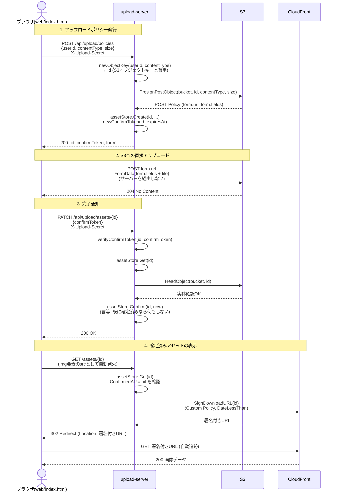
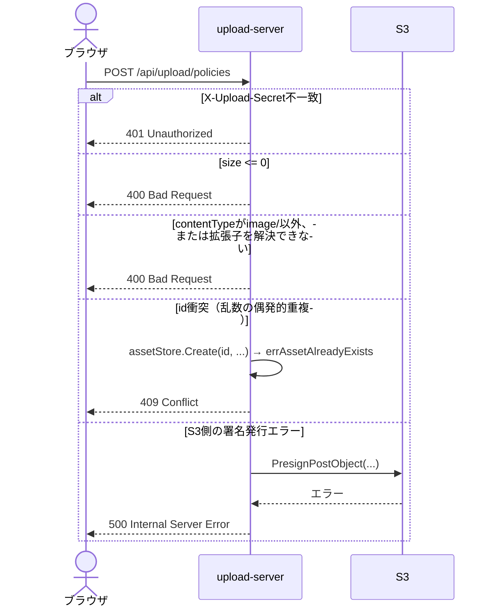
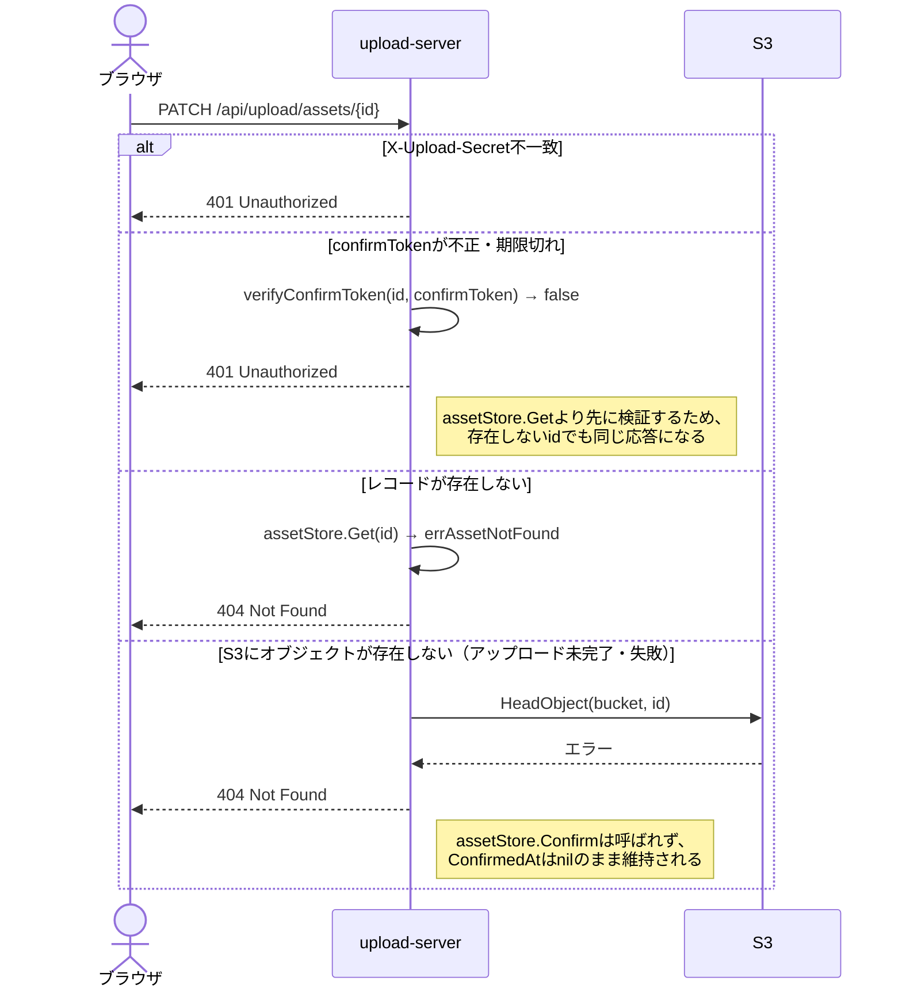
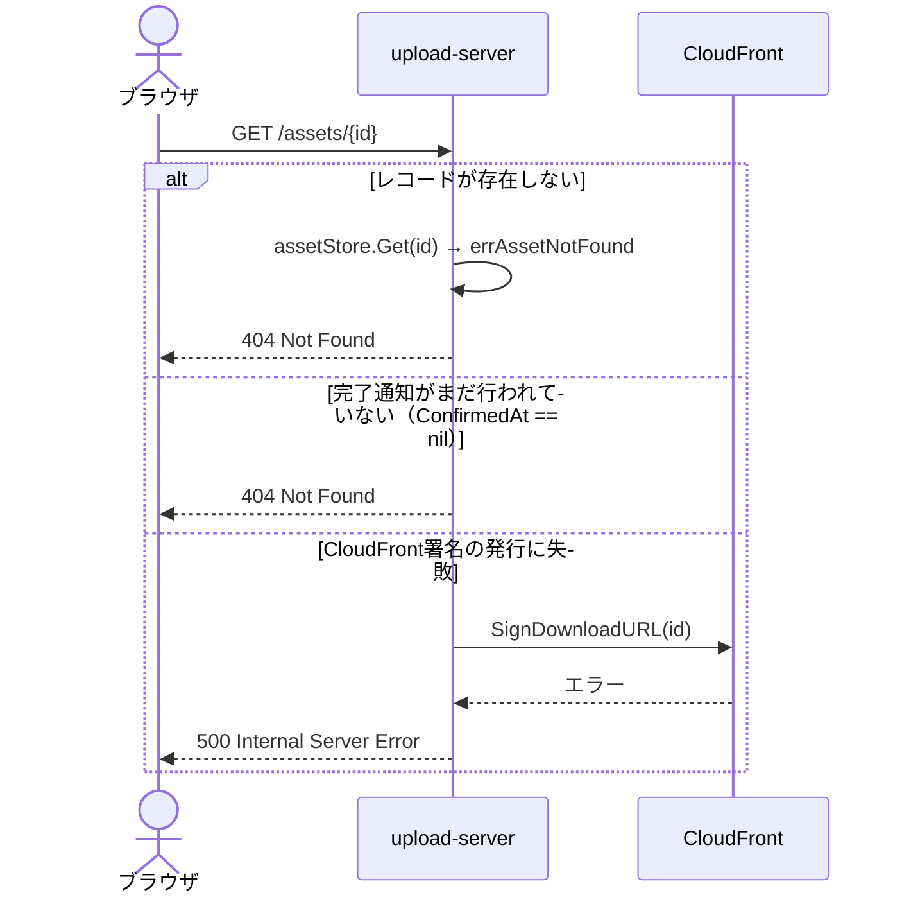

# アップロード〜配信シーケンス

`cmd/upload-server`が実装するGitHub/esa.io型のアップロードフロー（S3 POST Policy発行 → ブラウザから直接S3へPOST → 完了通知 → CloudFront Signed URLへのリダイレクト）の全体シーケンス。

## 全体フロー

## 異常系

### アップロードポリシー発行時のエラー

### 完了通知時のエラー

### アセット表示時のエラー

## 各ステップの要点

### 1. アップロードポリシー発行 (`POST /api/upload/policies`)

- `id`はS3オブジェクトキーと兼用（`users/{userID}/{16バイトhex}{拡張子}`形式）。別途の内部IDは発行しない
- S3 POST Policyの`content-length-range`は申告`size`を最小=最大に固定し、`Content-Type`も完全一致条件で指定する（GitHub/esa.ioの実測分析に基づく設計。[S3アップロードAPIのレスポンス設計比較(GitHub/esa.io)](https://scrapbox.io/tkdn/S3アップロードAPIのレスポンス設計比較(GitHub/esa.io))参照）
- `confirmToken`はHMAC-SHA256によるステートレストークンで、`id`と有効期限のみをメッセージにする。レコードストアを参照せずに検証できる

### 2. S3への直接アップロード

- ブラウザは`fetch(form.url, { method: 'POST', body: formData })`でS3へ直接POSTする。`upload-server`はバイト列を一切中継しない
- このリクエストはContent-Typeヘッダーを明示指定しないため、ブラウザが自動生成する`multipart/form-data`がCORSのsimple content-typeに該当し、preflightは発生しない（[S3 POST PolicyアップロードでCORS preflightが発生しない理由](https://scrapbox.io/tkdn/S3_POST_PolicyアップロードでCORS_preflightが発生しない理由)参照）

### 3. 完了通知 (`PATCH /api/upload/assets/{id}`)

- `confirmToken`の検証はレコードストアへの問い合わせより先に行う（無効なトークンでストアの存在有無を露呈させないため）
- `HeadObject`でS3上の実体を同期的に確認してから`ConfirmedAt`を設定する。確認に失敗した場合は404を返し、レコードは未確定のまま
- `Confirm`は冪等: 既に確定済みのレコードへの再呼び出しは、最初の確定時刻を保持したまま成功を返す

### 4. 確定済みアセットの表示 (`GET /assets/{id}`)

- ``とするだけで、ブラウザが302リダイレクトを自動追跡しCloudFront署名付きURLから画像を取得する
- 未確定（`ConfirmedAt == nil`）のアセットは404を返す
- 検証目的のため認証・認可を行わず、`id`の推測困難性のみに依存している。実運用ではここでリクエスト元の認証とアクセス認可を必須にすること
