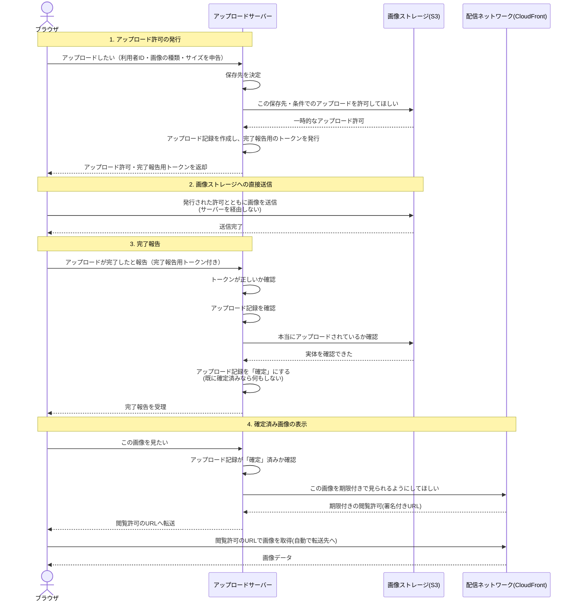
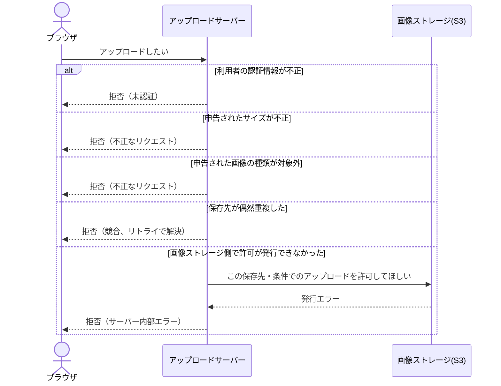
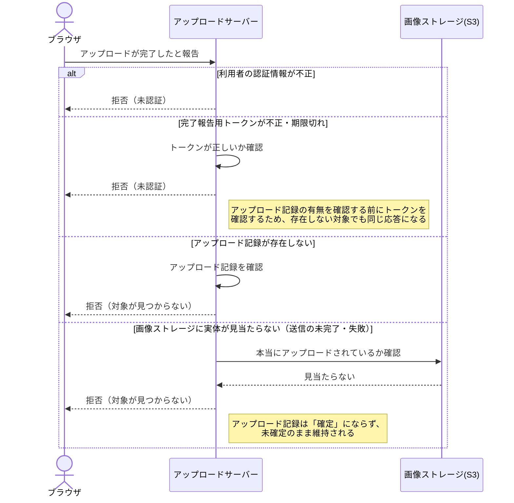
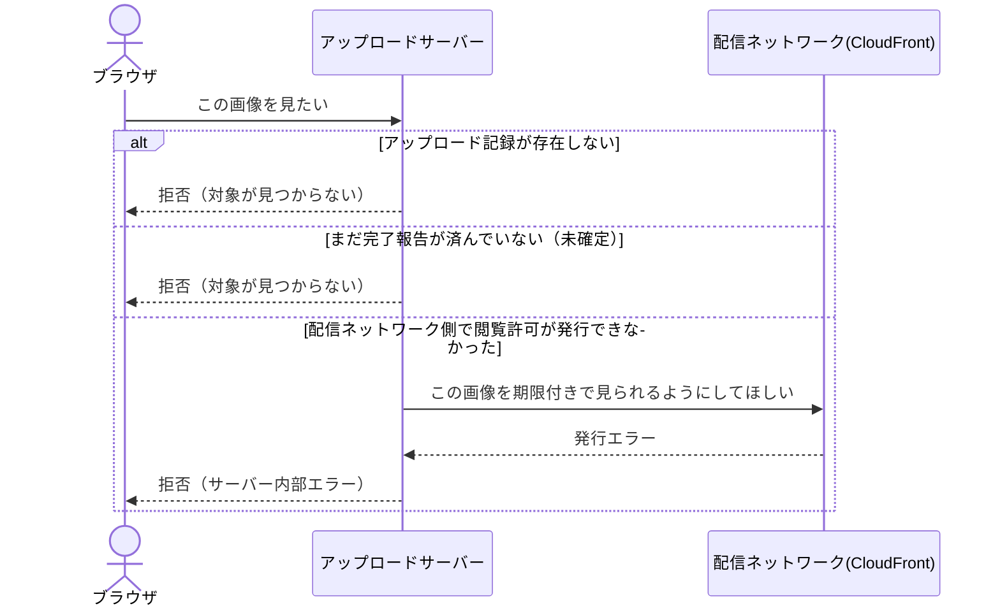

# アップロード〜配信シーケンス

`cmd/upload-server`が実装するGitHub/esa.io型のアップロードフロー（アップロード許可の発行 → ブラウザから画像ストレージへ直接送信 → 完了報告 → 署名付きURLでの配信）の全体シーケンス。

## 全体フロー

## 異常系

### アップロード許可の発行時のエラー

### 完了報告時のエラー

### 画像表示時のエラー

## 各ステップの要点

### 1. アップロード許可の発行

- 保存先（S3オブジェクトキー）は利用者IDと乱数から一意に生成し、アップロード記録の識別子と兼用する。利用者側は保存先を指定できない
- 発行される許可には「この画像サイズ・種類でしか使えない」という条件が完全一致で固定される（GitHub/esa.ioの実測分析に基づく設計。[S3アップロードAPIのレスポンス設計比較(GitHub/esa.io)](https://scrapbox.io/tkdn/S3アップロードAPIのレスポンス設計比較(GitHub/esa.io))参照）
- 完了報告用トークンは、対象の識別子と有効期限だけから検証できるステートレスな仕組みになっている

### 2. 画像ストレージへの直接送信

- ブラウザは画像ストレージへ直接送信し、アップロードサーバーはバイト列を一切中継しない
- この送信ではCORSの事前確認（プリフライト）が発生しない（[S3 POST PolicyアップロードでCORS preflightが発生しない理由](https://scrapbox.io/tkdn/S3_POST_PolicyアップロードでCORS_preflightが発生しない理由)参照）

### 3. 完了報告

- 完了報告用トークンの確認は、アップロード記録の有無を調べるより先に行う（不正なトークンから記録の存在有無を推測されないようにするため）
- 画像ストレージ側で実体を同期的に確認してから記録を「確定」にする。確認できなかった場合は拒否し、記録は未確定のまま
- 「確定」の処理は繰り返し呼んでも安全（最初に確定した時刻を保持し続ける）

### 4. 確定済み画像の表示

- ブラウザは画像を通常の``タグとして参照するだけで、期限付きの閲覧許可URLへの転送を自動的に追跡して表示する
- 完了報告がまだ済んでいない画像は「見つからない」扱いになる
- 検証目的のため認証・認可を行わず、保存先の推測困難性のみに依存している。実運用ではここでリクエスト元の認証とアクセス認可を必須にすること
